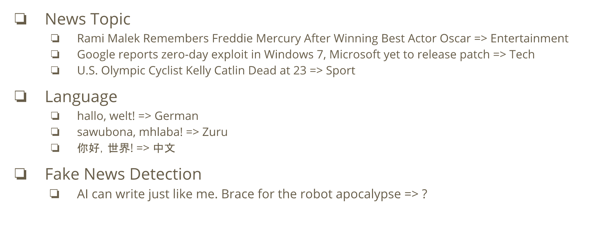
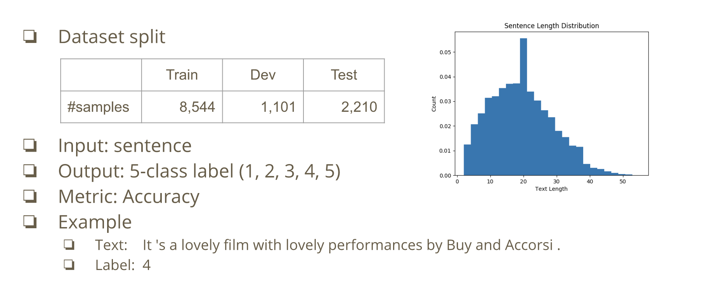
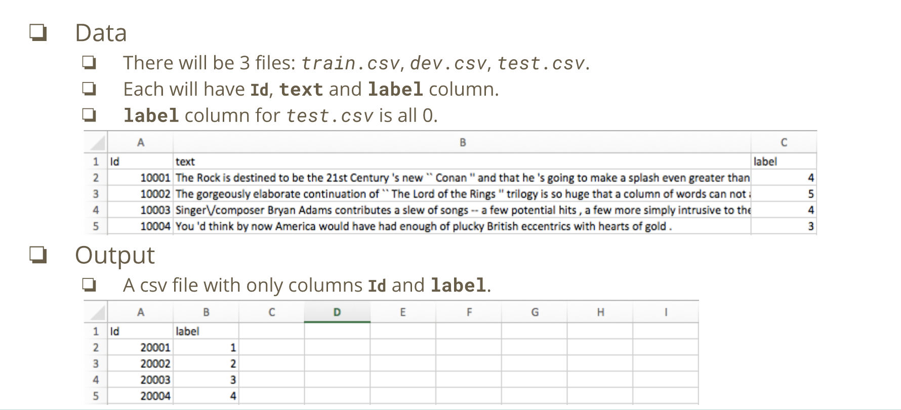
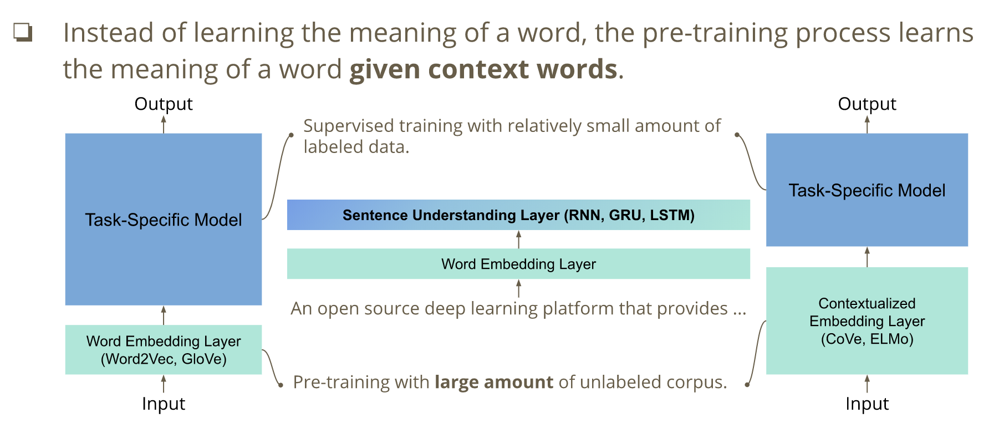
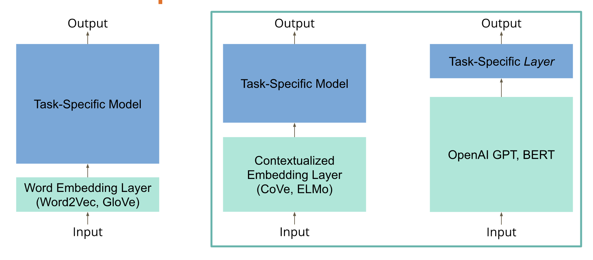

## Task

- **Sequence Classification:**

- **Dataset Details:**

- **Data Format:**

- **Contextual Embedding:**

- **NLP Model Input Features:**


## Requirements
1. Python>=3.5

2. Install the following required packages.
    ```
    pytorch==1.0
    spacy>=2.0
    pyyaml
    python-box
    tqdm
    ipdb
    ```

3. Download the English spacy model.
    ```
    python -m spacy download en
    ```

## Dataset
Extract data.
```
unzip data.zip
```

## ELMo
Your code for training ELMo should be placed under `ELMo/`. After finished training 
ELMo, you should implement the `Embedder` class in `ELMo/embedder.py`.

## BCN + ELMo for classification task
1. Create dataset object from raw data.
    ```
    mkdir -p dataset/classification
    cp bcn_classification_dataset_config_template.yaml dataset/classification/config.yaml
    python -m BCN.create_dataset dataset/classification
    ```
    **Do not modify the content in `config.yaml`.**

2. Train model.
    ```
    mkdir -p model/MODEL_NAME
    cp bcn_model_config_template.yaml model/MODEL_NAME/config.yaml
    python -m BCN.train model/MODEL_NAME
    ```
    **Other than `random_seed`, `device.*`, `elmo_embedder.*`, `use_elmo`,
    `train.n_epochs` and `train.n_gradient_accumulation_steps`, do not modify other
    settings in `config.yaml`.**

    Every epoch, a checkpoint of model parameters will be saved in
    `model/MODEL_NAME/ckpts`.

    You can observe training log with
    ```
    tail -f model/MODEL_NAME/log.csv
    ```

    If you ran into GPU out-of-memory error, you can increase the value of
    `train.n_gradient_accumulation_steps` to reduce the memory usage. This may make the
    training process a bit slower, but the performance should not be affected too much.

    If you want to train another model, simply repeat the above process with a different
    `MODEL_NAME`. Note that if the `model/MODEL_NAME` directory contains `ckpts/` or
    `log.csv`, the training script will not continue in case of overwriting existing
    experiment. 

3. Make prediction.

    Based on the development set performance, you can choose which epoch's model
    checkpoint to use to generate prediction. Optionally, you can specify the batch size.
    ```
    python -m BCN.predict model/MODEL_NAME EPOCH --batch_size BATCH_SIZE
    ```
    You will then have a prediction as a csv file that can be uploaded to kaggle under
    `model/MODEL_NAME/predictions/`.
